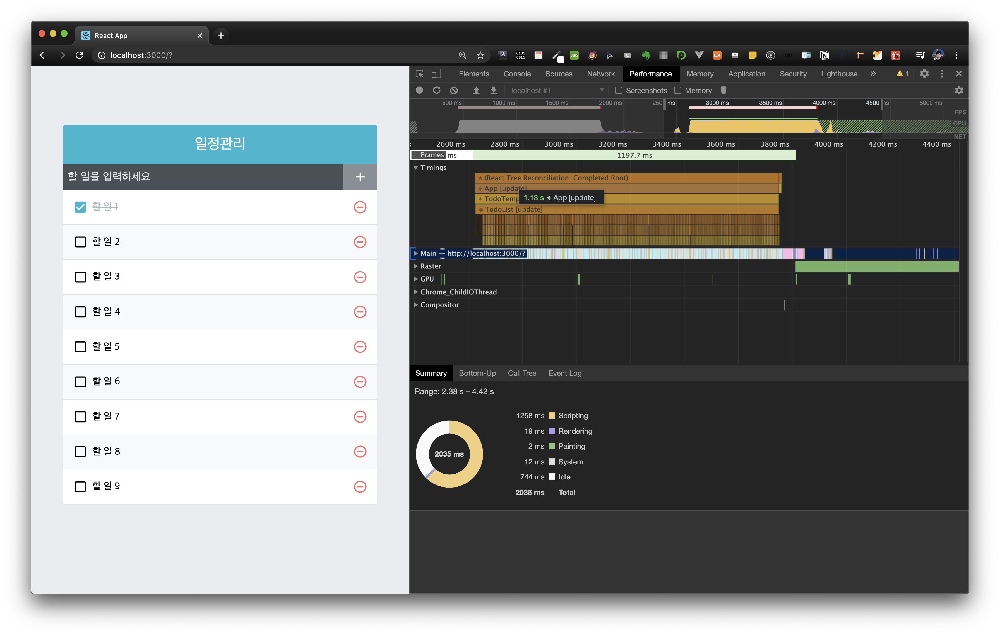
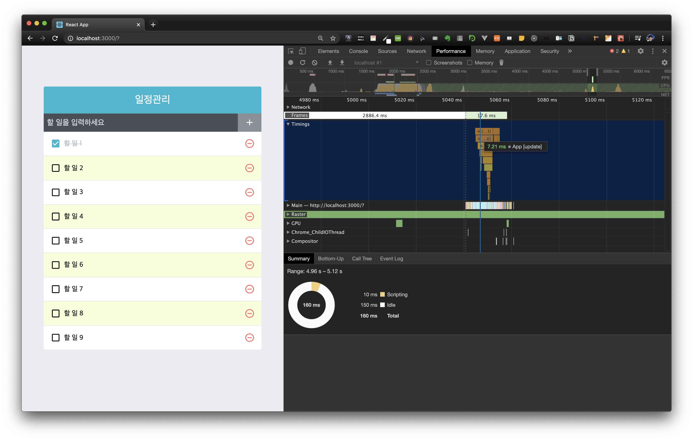

# 성능 체크 방법

- 체크박스 클릭시 시간이 얼마나 소요되는지 확인
- 개발자 도구에서 performance 텝에서 확인

# 성능 개선 세 가지

- `React.memo`를 통한 컴포넌트 리렌더링 성능 최적화

  - 불필요한 리렌더링을 줄여준다.
  - 리렌더링 방지할때는 클래스 컴포넌트에서는 "shouldUpdateComponent", 함수형 컴포넌트에서는 "React.memo" 함수를 사용한다.

- onToggle과 onRemove가 새로워지는 현상 방지하기

  - onToogle, onRemove 기능은 최신 상태의 todos를 참조하기 때문에 todos배열이 바뀔 때마다 함수가 새로 만들어진다.
  - 해결방법2가지: 1.`useState` 함수형 업데이트 기능 사용 & 2.`useReducer` 사용

- `react-virtualized` library를 사용한 렌더랑 최적화
  - 리스트 컴포넌트에서 스크롤되기 전에 보이지 않는 컴포넌트는 렌더링하지 않고 크기만 차지하게하고 스크롤되서 해당 스크롤위치에서 보여주어야 할 컴포넌트를 자연스럽게 렌더링 시킨다.
  - 적용시 드라마틱하게 소요시간 줄어든다.

## 성능 개선전

- 1.13s

## React.memo 적용 & onToggle, onRemove 함수 새로워지는 현상 방지

- 1.11s

.png>)

## react-virtualized library

- 7.21ms !!

